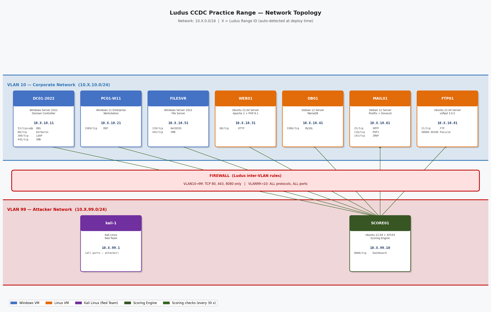

# CCDC Practice Range — Network Diagram



> **Note:** `X` in all IP addresses is the Ludus **Range ID**, which is auto-detected from the scoring engine's VLAN 99 IP at deploy time. With a range ID of `10`, for example, the corporate network becomes `10.10.10.0/24`.

---

## IP Address & Port Reference

### VLAN 10 — Corporate Network (`10.X.10.0/24`)

| Hostname | IP Address | Open Ports | Protocol | Service | Scored? | Points |
|----------|-----------|-----------|----------|---------|:-------:|-------:|
| DC01-2022 | `10.X.10.11` | 53 | TCP+UDP | DNS | Yes | 100 |
| DC01-2022 | `10.X.10.11` | 88 | TCP | Kerberos | Yes | 100 |
| DC01-2022 | `10.X.10.11` | 389 | TCP | LDAP | Yes | 100 |
| DC01-2022 | `10.X.10.11` | 445 | TCP | SMB (AD) | — | — |
| PC01-W11 | `10.X.10.21` | 3389 | TCP | RDP | Yes | 50 |
| WEB01 | `10.X.10.31` | 80 | TCP | HTTP | Yes | 100 |
| DB01 | `10.X.10.41` | 3306 | TCP | MySQL/MariaDB | Yes | 75 |
| FILESVR | `10.X.10.51` | 139 | TCP | NetBIOS | — | — |
| FILESVR | `10.X.10.51` | 445 | TCP | SMB | Yes | 50 |
| MAIL01 | `10.X.10.61` | 25 | TCP | SMTP | Yes | 75 |
| MAIL01 | `10.X.10.61` | 110 | TCP | POP3 | Yes | 50 |
| MAIL01 | `10.X.10.61` | 143 | TCP | IMAP | Yes | 50 |
| FTP01 | `10.X.10.81` | 21 | TCP | FTP (control) | Yes | 50 |
| FTP01 | `10.X.10.81` | 40000–40100 | TCP | FTP (passive data) | — | — |

**Total scored ports on VLAN 10: 11 checks — 800 points max per round**

---

### VLAN 99 — Attacker Network (`10.X.99.0/24`)

| Hostname | IP Address | Open Ports | Protocol | Service | Notes |
|----------|-----------|-----------|----------|---------|-------|
| kali-1 | `10.X.99.1` | All | All | Attacker workstation | Red team, unrestricted access to VLAN 10 |
| SCORE01 | `10.X.99.10` | 8080 | TCP | Scoring dashboard (HTTP) | Accessible from VLAN 10 on port 8080 |

---

## Firewall Rules

| Rule | Source VLAN | Destination VLAN | Protocol | Ports | Action |
|------|------------|-----------------|----------|-------|--------|
| Corporate → Attacker (web/score) | VLAN 10 | VLAN 99 | TCP | 80, 443, 8080 | ACCEPT |
| Attacker → Corporate (all) | VLAN 99 | VLAN 10 | ALL | ALL | ACCEPT |
| All other inter-VLAN | Any | Any | ALL | ALL | REJECT |

> The firewall is managed by Ludus at the hypervisor level — individual VMs have their host-based firewalls (UFW / Windows Firewall) **intentionally disabled** as part of the CCDC vulnerability set.

---

## Network Topology (ASCII)

```
                    ┌─────────────────────────────────────────────────────────────┐
                    │            VLAN 10 — Corporate (10.X.10.0/24)               │
                    │                                                             │
                    │  DC01-2022       PC01-W11        FILESVR                   │
                    │  10.X.10.11      10.X.10.21      10.X.10.51                │
                    │  :53  DNS        :3389 RDP        :139 NetBIOS              │
                    │  :88  Kerberos                   :445 SMB                  │
                    │  :389 LDAP                                                  │
                    │  :445 SMB                                                   │
                    │                                                             │
                    │  WEB01           DB01            MAIL01          FTP01      │
                    │  10.X.10.31      10.X.10.41      10.X.10.61      10.X.10.81 │
                    │  :80  HTTP       :3306 MySQL      :25  SMTP       :21  FTP   │
                    │                                   :110 POP3       :40000-   │
                    │                                   :143 IMAP       :40100    │
                    └────────────────────────┬────────────────────────────────────┘
                                             │
                              ╔══════════════╧════════════════╗
                              ║            FIREWALL            ║
                              ║  VLAN10→99: TCP 80,443,8080   ║
                              ║  VLAN99→10: ALL/ALL (ACCEPT)  ║
                              ╚══════════════╤════════════════╝
                                             │
                    ┌────────────────────────┴────────────────────────────────────┐
                    │            VLAN 99 — Attacker (10.X.99.0/24)               │
                    │                                                             │
                    │  kali-1                              SCORE01                │
                    │  10.X.99.1                           10.X.99.10             │
                    │  (all tools — kali-linux-default)    :8080 Dashboard        │
                    │                                                             │
                    └─────────────────────────────────────────────────────────────┘
```

---

## Scoring Engine Check Summary

The scoring engine (`SCORE01:8080`) polls VLAN 10 services every **30 seconds** using the following checks:

| Check | Target | Port | Method | Credentials | Points |
|-------|--------|------|--------|-------------|-------:|
| DNS | DC01 `10.X.10.11` | 53/UDP | A-record query for `web.ludus.domain` | None | 100 |
| Kerberos | DC01 `10.X.10.11` | 88/TCP | TCP connect | None | 100 |
| LDAP | DC01 `10.X.10.11` | 389/TCP | LDAPv3 anonymous bind | None | 100 |
| HTTP | WEB01 `10.X.10.31` | 80/TCP | HTTP GET + content validation | None | 100 |
| SMTP | MAIL01 `10.X.10.61` | 25/TCP | 220 banner + EHLO 250 response | None | 75 |
| MySQL | DB01 `10.X.10.41` | 3306/TCP | MySQL handshake banner parse | None | 75 |
| IMAP | MAIL01 `10.X.10.61` | 143/TCP | IMAP LOGIN command | `jsmith` / `Ludus2025!` | 50 |
| POP3 | MAIL01 `10.X.10.61` | 110/TCP | `+OK` banner check | None | 50 |
| SMB | FILESVR `10.X.10.51` | 445/TCP | SMBv1/v2 negotiate | None | 50 |
| FTP | FTP01 `10.X.10.81` | 21/TCP | FTP authenticated login | `mlopez` / `Ludus2025!` | 50 |
| RDP | PC01-W11 `10.X.10.21` | 3389/TCP | CredSSP/NLA NTLMv2 handshake | `jsmith` / `Ludus2025!` (domain) | 50 |
| **Max per round** | | | | | **800** |
